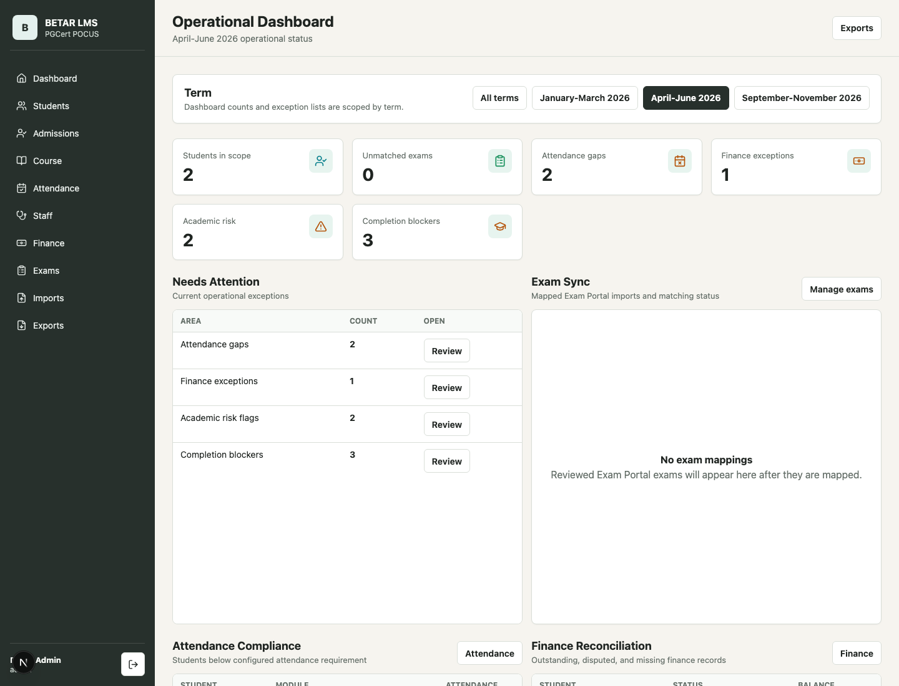
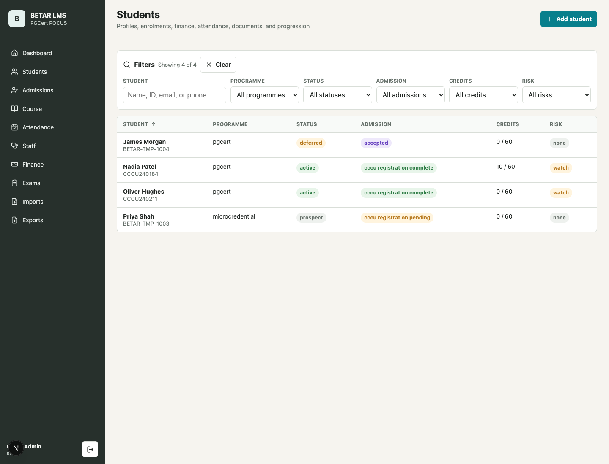
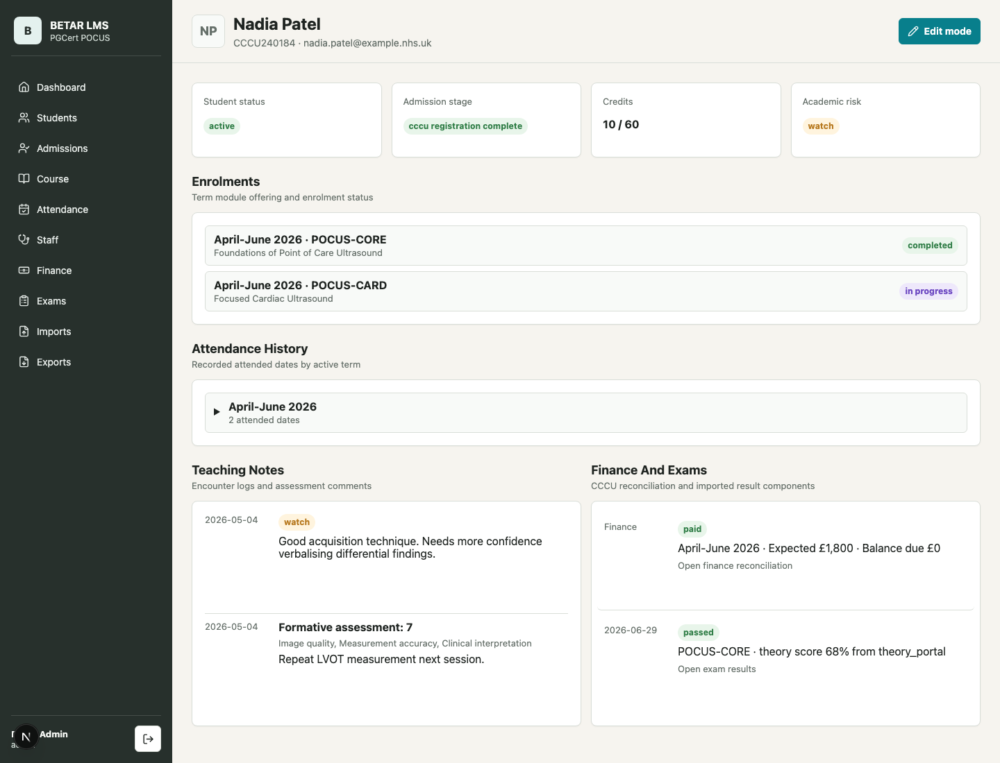
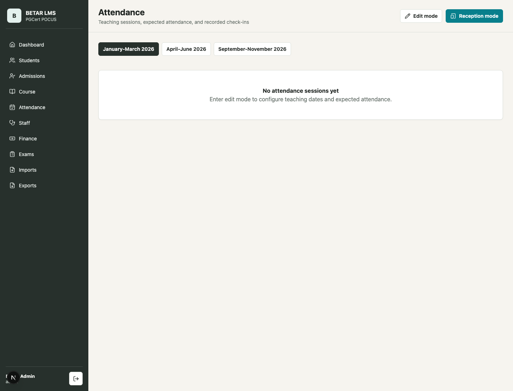
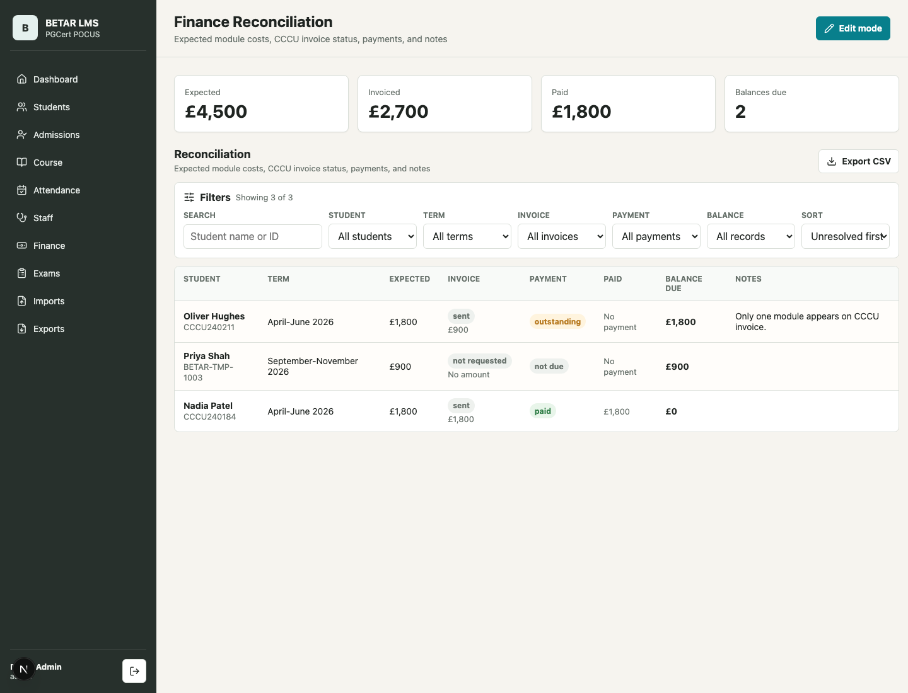
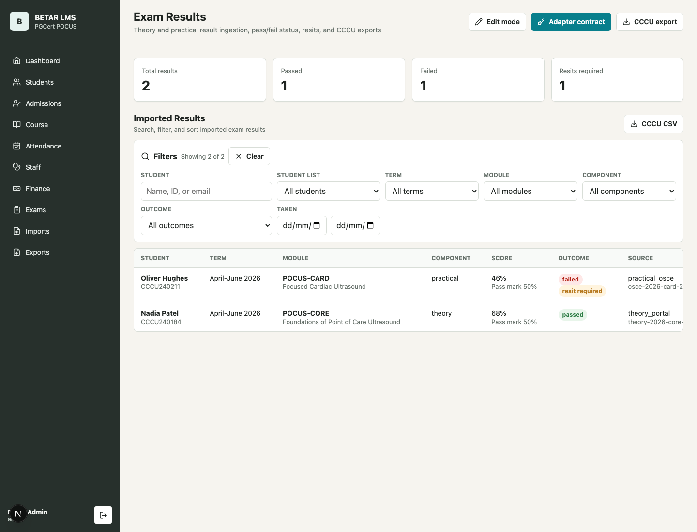

# BETAR LMS Staff User Guide

This guide is for day-to-day staff use of BETAR LMS. It avoids technical setup details and focuses on where to go, what to update, and what each area is for.

Screenshots shown here use demo data. Live names, dates, numbers, and available menu items may differ.

## Quick Reference

| Need to do this | Go here |
| --- | --- |
| Check what needs attention today | Dashboard |
| Find a student or open a profile | Students |
| Add a prospect or admissions lead | Admissions |
| Add or change terms, modules, offerings, prices, attendance requirements | Course |
| Review or amend attendance | Attendance |
| Use a check-in tablet | Reception mode |
| Record teaching notes, formative assessments, or presentation scores | Staff |
| Check invoices, payments, and balances | Finance |
| Review exam results, sync Exam Portal results, or resolve unmatched submissions | Exams |
| Download CSV files | Exports |
| Get CSV templates | Imports |

## Sign In And Navigation

Use your BETAR LMS staff email and password to sign in. After signing in, use the menu on the left to move between areas.

Your menu depends on your role:

| Role | Main access |
| --- | --- |
| Admin | Full LMS access |
| Teacher | Dashboard, Students, Staff |
| Reception | Reception check-in only |

To sign out, use the sign-out button at the bottom-left of the sidebar.

> Screenshot placeholder: sign-in screen

## View Mode And Edit Mode

Many admin pages have `View mode` and `Edit mode`.

Use `View mode` to review information safely.

Use `Edit mode` when you need to add, update, delete, import, sync, or reconcile records.

Important habits:

- Changes are not saved until you press the relevant `Save`, `Create`, `Import`, `Generate`, `Assign`, or `Sync` button.
- Delete actions usually require ticking a confirmation checkbox first.
- Some deletes are blocked when other records still depend on the item. For example, an offering with student enrolments cannot be deleted until those enrolments are removed or moved.
- Attendance edit screens warn about unsaved changes. Save before leaving the page.

## Dashboard

Use the Dashboard as the first place to check operational issues.

What to check:

- Choose a term at the top, or choose `All terms`.
- Metric cards show counts for students, unmatched exams, attendance gaps, finance exceptions, academic risk, and completion blockers.
- `Needs Attention` lists current exceptions with `Review` links.
- The lower dashboard sections show attendance compliance and finance reconciliation problems.
- Use `Exports` when you need downloadable operational files.

## Students

Use `Students` to search, filter, open profiles, and add student or prospect records.

Find a student:

- Search by name, ID, email, or phone.
- Filter by programme, status, admission stage, credits, or academic risk.
- Click column headings to sort.
- Click a student name to open the profile.

Add a student or prospect:

1. Go to `Students`.
2. Select `Add student`.
3. Enter identity, contact, programme, start term, status, admission stage, and notes.
4. Select `Create student`.

## Student Profiles

Student profiles bring together identity, enrolments, attendance, teaching notes, finance, and exams.

In view mode, use the profile to check:

- Current student and admission status.
- Credits toward the 60-credit target.
- Academic risk status.
- Enrolments and module progress.
- Attendance history.
- Teaching notes, formative assessments, and presentation scores.
- Finance and exam records.

In edit mode, admins can:

- Update student details, lifecycle status, admission stage, and notes.
- Add, update, or delete enrolments.
- Add attendance overrides or presentation requirement overrides.
- Upload, replace, or remove the student photo.
- Amend attendance for that student.
- Create or update finance rows for the student.
- Delete the student record when appropriate.

Use overrides only when the student should differ from the normal module or offering rule.

## Admissions

Use `Admissions` for early enquiries and prospects before they become full student records.

Typical workflow:

1. Open `Admissions`.
2. Select `Edit mode`.
3. Use `Quick Create Lead` for a new enquiry.
4. Keep the lead stage up to date: interest, application invited, submitted, reviewed, offered, rejected, accepted, or archived.
5. Record module interests, source, last contacted date, next action date, and notes.
6. When a lead reaches `accepted`, use `Convert to student` to create the full student profile.

Use `Import Students CSV` only for later-stage records that should already become student records.

> Screenshot placeholder: admissions board and accepted-lead conversion form

## Course

Use `Course` for the structure that other pages rely on: modules, terms, offerings, prices, attendance requirements, and assessment definitions.

In edit mode, admins can add and update:

- Modules: code, title, credits, online/practical mode, mandatory flag.
- Terms: teaching dates, exam window, status.
- Offerings: module linked to term, price, capacity, required practical attendance days, presentation requirement.
- Assessment definitions used by staff formative assessment forms.

Term statuses:

| Status | Meaning |
| --- | --- |
| Draft | Not ready for normal use |
| Published | Planned and visible for upcoming work |
| Active | Current teaching term |
| Closed | Historic term |

Nuance: the `Staff` teaching page only works when there is an active term with active enrolled students.

> Screenshot placeholder: course configuration edit mode

## Attendance

Use `Attendance` to review sessions, create teaching dates, and amend attendance records.

Review attendance:

- Choose the term tabs at the top.
- Open a session to see expected, attended, missed, location, and student details.
- Students who were expected but have no attendance record may count as missed.

Set up or amend attendance:

1. Go to `Attendance`.
2. Select `Edit mode`.
3. Choose the term.
4. Add a teaching session with date, start time, end time, and location.
5. Open `Manage attendance records`.
6. Add a student or update an existing student row.
7. Choose whether the student was expected.
8. Set status: no record, attended, partial, or missed.
9. Add an optional note.
10. Save the row.

Delete attendance or sessions only when you are sure. Delete actions have confirmation steps.

## Reception Mode

Use `Reception mode` for tablet-style check-in and check-out on the day of teaching.

How it works:

- It only shows teaching sessions dated today.
- If there are multiple sessions today, choose the session start time.
- Tap the student row to check the student in.
- Tap again to check the student out.
- Once checked out, the row shows as complete.

If no sessions appear, check that the session date in `Attendance` matches today and that expected students have been added.

> Screenshot placeholder: reception check-in screen

## Staff Teaching

Use `Staff` to record teaching activity during the active term.

Staff can:

- Choose a student and module.
- Save an encounter log with date, concern level, and summary.
- Complete formative assessments for configured assessment definitions.
- Save presentation scores for case presentations or journal clubs.
- Review recent teaching records for the selected student.
- Open the full student profile.

Concern levels:

| Level | Use when |
| --- | --- |
| None | No concern to flag |
| Watch | Keep an eye on progress |
| Support needed | Student needs active support or follow-up |

If the page says there is no active term or no active enrolled students, an admin should check `Course` and the student enrolments.

> Screenshot placeholder: staff teaching workflow

## Finance

Use `Finance` to reconcile expected module costs, CCCU invoice status, payments, balances, and notes.

Review finance:

- Use filters for search, student, term, invoice status, payment status, balance, and sort order.
- Problem rows include balances, missing/requested invoices, outstanding payments, or disputes.
- Download the finance reconciliation CSV from the page or from `Exports`.

Create or update finance records:

1. Go to `Finance`.
2. Select `Edit mode`.
3. Use `Generate Expected Rows` to create expected term rows from enrolments and offering prices.
4. Use `Add Finance Record` for a manual one-student, one-term row.
5. Update expected amount, invoice status, invoice amount, payment status, paid amount, and notes.
6. Save changed rows.

Balance due is based on expected amount compared with paid amount. Keep notes short but clear for exceptions.

## Exams

Use `Exams` to review imported results, sync Exam Portal mappings, resolve unmatched submissions, and export CCCU results.

Review exam results:

- Filter by student, term, module, component, outcome, and taken date.
- Sort by student, term, module, component, score, outcome, source, or taken date.
- Use `CCCU export` to download the result CSV.

Sync Exam Portal results:

1. Go to `Exams`.
2. Select `Edit mode`.
3. Add or update an Exam Portal mapping.
4. Choose term, exam kind, module where relevant, active status, and whether physics/equipment contributes.
5. Select `Sync from Exam Portal`.
6. Review `Exam Exceptions` for unmatched submissions.
7. Assign unmatched submissions to the correct LMS student.

Use `Manual JSON Import` only when instructed. It is for specialist import or adapter testing workflows.

## Imports

Use `Imports` mainly to download CSV templates.

Available templates:

- Students and prospects.
- Enrolments.
- Finance reconciliation.
- Historic attendance.

Fill templates carefully and keep identifiers consistent. Use imports for bulk setup or backfill rather than routine single-record changes.

## Exports

Use `Exports` to download:

- CCCU exam results.
- Finance reconciliation.

These are operational downloads, so check filters and records before sending files outside the LMS.

## Common Questions

### Why can I not see a menu item?

Your role controls the menu. Admins see all areas, teachers see student and teaching areas, and reception users only see reception check-in.

### Why is a student missing from Staff Teaching?

The student must be active and enrolled in an offering for the active term. Check the student profile and the term status in `Course`.

### Why does Reception Mode show no students?

Reception mode only shows today's sessions and expected students. Check the session date and expected attendance list in `Attendance`.

### Why can I not delete an offering?

Offerings with linked enrolments are protected. Move or remove the enrolments first.

### Why is someone marked as an attendance gap?

Attendance gaps are based on the required attendance days for practical modules, including any student-specific override.

### Why is a finance row highlighted?

It may have a balance due, missing/requested invoice, outstanding payment, dispute, or overpayment.

### Why is an exam submission unmatched?

The Exam Portal submission could not be confidently linked to an LMS student. Assign it manually in `Exams` edit mode.

### What should I do before leaving an edit page?

Save any changed row or form. On attendance pages, pay attention to unsaved-change warnings.
